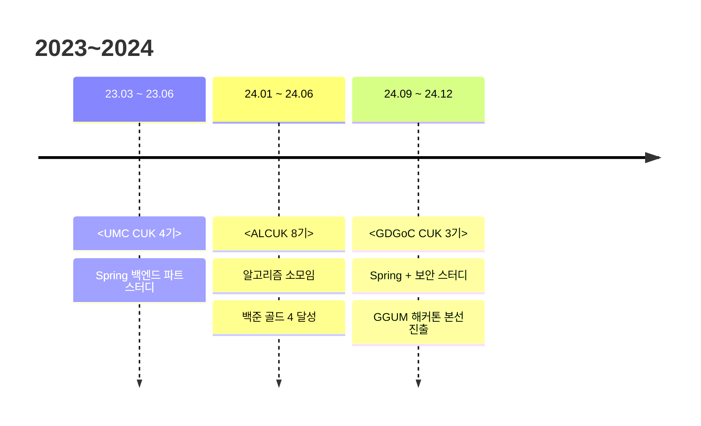
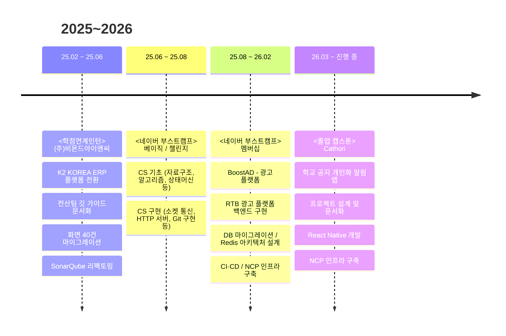

  

## 👋 About Me

- 시스템의 동작을 정확히 파악하고, 이전 버전과의 비교 검증을 통해 변경의 정확성을 확인합니다.
- 도메인의 핵심 요구사항을 먼저 파악하고, 그에 맞게 기술적 우선순위를 정하는 설계를 지향합니다.
- 더 좋은 기술보다 현재 상황에 적합한 기술을 선택하며, 맞지 않으면 롤백할 줄 아는 유연함을 중요하게 생각합니다.
- 해결한 문제는 팀에 공유하고, 코드와 문서 모두 읽히는 것을 기본으로 여깁니다.

---

## 🗓️ Growth Timeline

---

---

## 🛠️ Tech Stacks

#### Frontend

#### Backend

 

#### Database / Cache

 

#### Infra / DevOps

 

 
 

#### Tools

 

 

---
